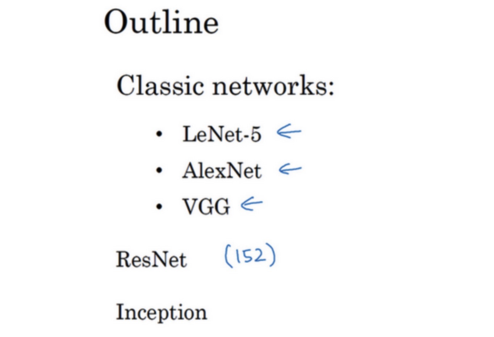

# 前言
上周学习了基本构建，如卷积层 、池化层以及全连接层等这些组件，事实上，计算机视觉研究中的大量研究都集中在如何把这些基本构建组合起来，形成有效的神经网络？
最好的学习方法：看案例。就像很多人通过看别人的代码来学习编程一样，通过研究别人构建有效组件的案例是个不错的办法。实际上在计算机视觉任务中表现良好的神经网络框架往往也适用于其它任务，一些好的神经网络框架，有可能也适用于解决你的问题。
这是后面几节课的提纲，首先我们来看几个经典的网络。

LeNet-5网络，经常被引用的AlexNet，还有VGG网络。这些都是非常有效的神经网络范例，当中的一些思路为现代计算机视觉技术的发展奠定了基础。论文中的这些想法可能对你大有裨益，对你的工作也可能有所帮助。  
然后是ResNet，又称残差网络。这个网络训练了一个深达152层的神经网络，并且在如何有效训练方面，总结出了一些有趣的想法和窍门。最后我们还会讲一个Inception神经网络的实例分析。  
了解了这些神经网络，我相信你会对如何构建有效的卷积神经网络更有感觉。即使计算机视觉并不是你的主要方向，但我相信你会从ResNet和Inception网络这样的实例中找到一些不错的想法。这里面有很多思路都是多学科融合的产物。
总之，即便你不打算构建计算机视觉应用程序，试着从中发现一些有趣的思路，对你的工作也会有所帮助。  
接下来我们会详细分析每个网络，下节见！